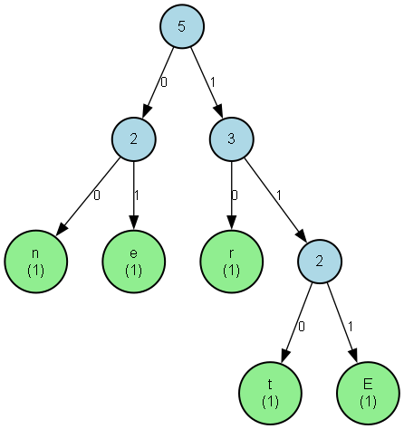

# 🌳 Huffman Coding Visualizer

An implementation and visualization of the **Huffman Coding Algorithm** developed in Python. This project builds a minimum-redundancy prefix tree using a greedy min-heap approach, encodes/decodes custom text, evaluates compression performance, and renders a hierarchical binary tree graphic using NetworkX and Graphviz.

---

## 📸 Visualization Preview

The algorithm generates a directed tree representing the optimal variable-length prefix codes:



* **Green Nodes:** Leaf nodes containing character symbols and individual frequencies.
* **Blue Nodes:** Internal nodes showing aggregated subtree frequencies.
* **Edge Labels (`0` / `1`):** Traversal path bits (`0` for left branch, `1` for right branch).

---

## 🚀 Key Features

* **Character Frequency Analysis:** Counts character distribution using Python's `collections.Counter`.
* **Min-Heap Construction:** Leverages `heapq` to efficiently extract the two lowest-frequency nodes in $O(k \log k)$ time.
* **Prefix-Free Code Generation:** Recursively traverses the binary tree to derive optimal variable-length binary codes.
* **Encoding & Decoding Pipeline:** Converts raw text to a bitstream and reconstructs the original string by walking down the tree.
* **Compression Analytics:** Compares raw ASCII bit counts against compressed bit counts and calculates compression and space-saved percentages.
* **Automated Artifact Export:** Saves the generated tree diagram (`huffman_tree.png`), serialized codebook (`codes.json`), and encoded text (`compressed.txt`) to an `outputs/` directory.

---

## 📊 Sample Output (e.g., Input: "BANANA")

```text
============================================================
                 CHARACTER FREQUENCY TABLE                  
============================================================
Character           Frequency
A                   3
B                   1
N                   2

============================================================
                  GENERATED HUFFMAN CODES                   
============================================================
Character           Code
A                   0
B                   10
N                   11

============================================================
                   COMPRESSION STATISTICS                   
============================================================
Original Size       : 48 bits (6 characters × 8 bits)
Compressed Size     : 9 bits
Compression Ratio   : 18.75%
Space Saved         : 81.25%
